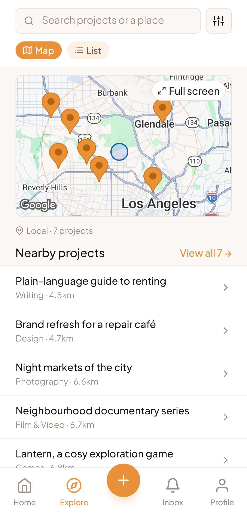
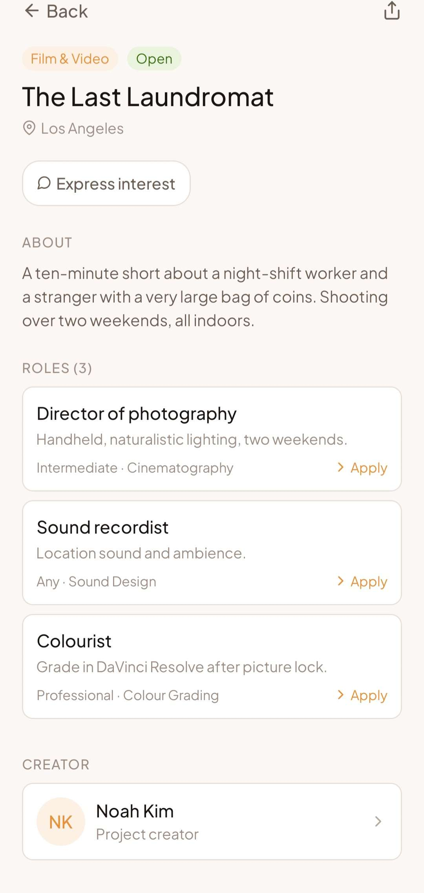
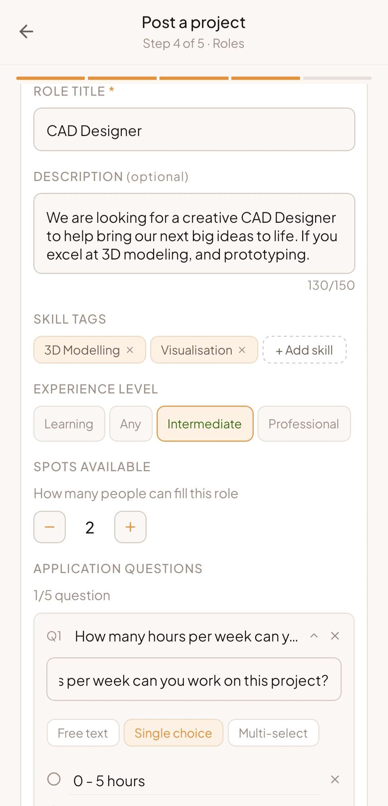
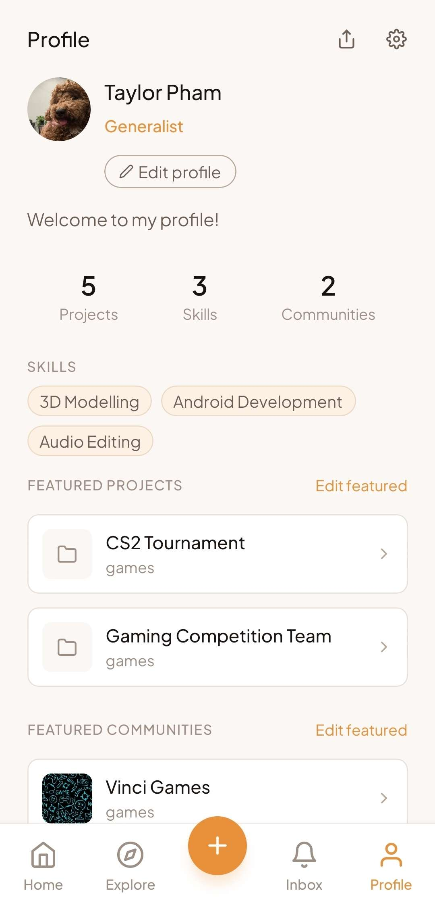
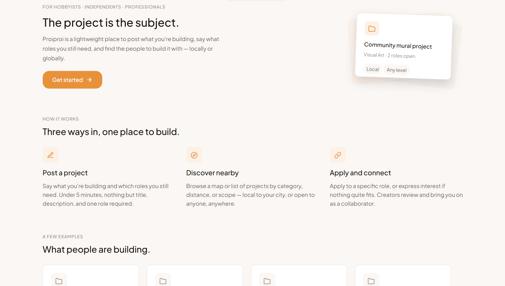
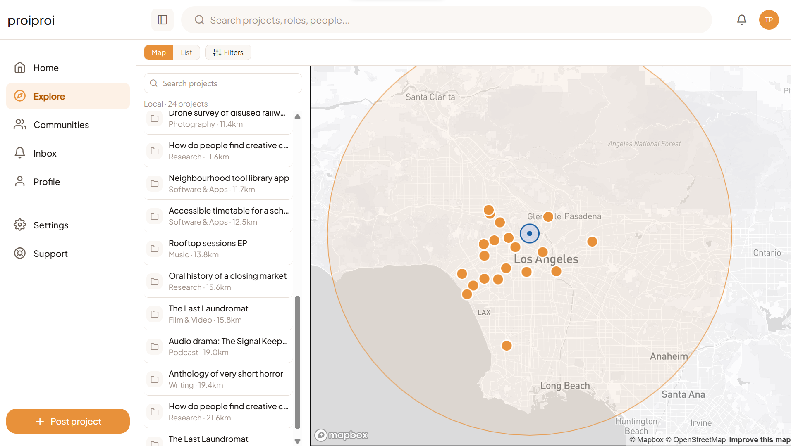
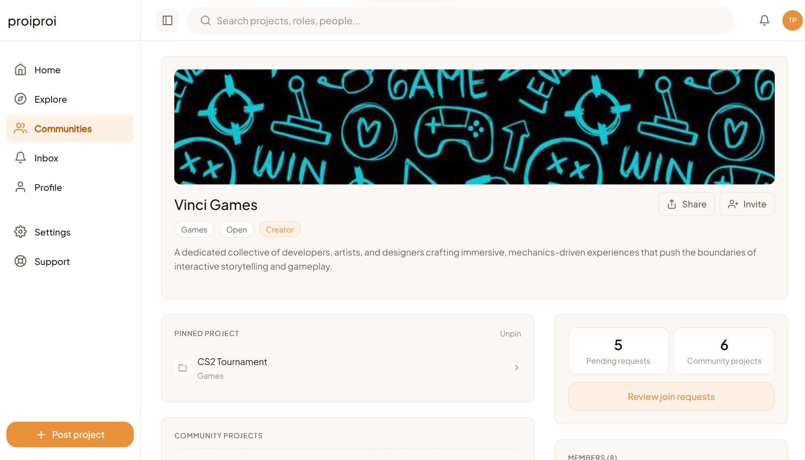

# Proiproi

**Post a project, define the roles you need, find your people. Locally or globally.**

Proiproi is a lightweight platform for anyone with a project and an incomplete team: hobbyists looking for a co-creator, independent creatives recruiting collaborators, and professionals assembling specialist teams. The project is the centre of the product, not the person.

**Website:** [proiproi.com](https://proiproi.com)
**Status:** in development, approaching launch

> This repository is a showcase. It holds screenshots, the product spec and the roadmap. The app's source code is private.

---

## Screenshots

### Mobile

| Explore | Project | Post a project | Profile |
| --- | --- | --- | --- |
|  |  |  |  |

### Web

| Landing page | Explore | Community |
| --- | --- | --- |
|  |  |  |

---

## How it works

1. **Post a project.** Say what you are building and which roles you still need. It takes under five minutes, and only a title, a description and one role are required.
2. **Discover nearby.** Browse a map or a list of projects by category, distance or scope: local to your city, or open to anyone, anywhere.
3. **Apply and connect.** Apply to a specific role, or express interest if nothing quite fits. Creators review applications and bring people on as collaborators.

## Who it is for

- **Hobbyists and side-project makers.** An idea you want to pursue outside of work. No portfolio or credentials needed.
- **Independent creatives.** Musicians, filmmakers, artists, writers, designers and photographers putting together a team for a specific project.
- **Professionals and specialists.** Domain experts who want to lend their skills to a project they believe in, or recruit collaborators for their own work outside their main job.

## Features

**Projects and roles**
- Post a project with a cover image and up to three pieces of feature media (images, files, YouTube or Vimeo links)
- Up to six roles per project, each with skill tags and an experience level (Learning, Any, Intermediate, Professional)
- Multiple spots per role, for when you need more than one person
- Optional application questions per role: free text, single choice or multi-select
- "Express interest" for people who don't see their exact role

**Discovery**
- Map and list views, with local and all-projects scope and an adjustable radius
- Filter by category and experience level
- Search across projects, roles, communities and people
- A starter skill taxonomy across music, film, art, design, photography, writing, software, games, podcasts and research, plus free-form tags

**Working together**
- Project members with creator, administrator and member roles
- Task lists per project, with due dates and multiple assignees
- Shared project files, with per-file visibility for everyone or managers only
- An Inbox for applications, invites and activity, with status updates as applications are reviewed

**Communities**
- Create or join communities around a craft or interest
- Open, application or invite-only joining
- Pin a project, invite members and review join requests

**Profiles**
- Skills, location and a short bio
- Feature up to three projects and three communities on your profile
- Light and dark mode that follow your device

## Design principles

- **Accessible.** No portfolio or credential checks. A hobbyist and a professional use the same interface.
- **Lightweight.** From idea to posted project in under five minutes.
- **Project-first.** The project is the main object. Profiles support projects, they don't replace them.
- **Local and global.** The creator chooses the scope for each project, and both are first-class.
- **Useful for everyone.** Filters and discovery work at every skill level.

## Built with

React Native and Expo for iOS, Android and web from one codebase, with Firebase on the backend.

## Docs

- [Product spec](docs/SPEC.md)
- [Roadmap](ROADMAP.md)

## Feedback

Ideas and bug reports are welcome in [Issues](../../issues).

## Licence

Copyright (c) 2026 Proiproi. All rights reserved. The contents of this repository may not be reused without permission.
